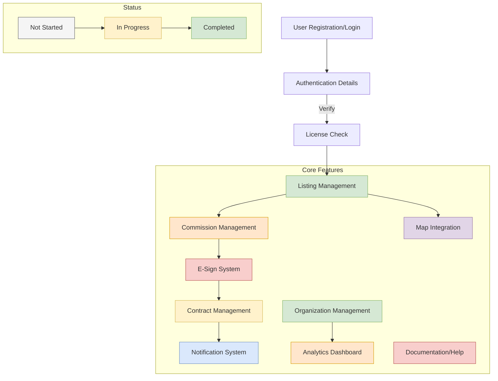

```mermaid
graph TD
    %% Authentication Flow
    A[User Registration/Login] --> B[Authentication Details]
    B --> |Verify| C[License Check]
    
    %% Core Features Container
    subgraph Core Features
        %% Listing Management
        D[Listing Management]
        style D fill:#d5e8d4,stroke:#82b366
        
        %% Commission Management
        E[Commission Management]
        style E fill:#ffe6cc,stroke:#d79b00
        
        %% E-Sign System
        F[E-Sign System]
        style F fill:#f8cecc,stroke:#b85450
        
        %% Map Integration
        G[Map Integration]
        style G fill:#e1d5e7,stroke:#9673a6
        
        %% Contract Management
        H[Contract Management]
        style H fill:#fff2cc,stroke:#d6b656
        
        %% Notification System
        I[Notification System]
        style I fill:#dae8fc,stroke:#6c8ebf
        
        %% Organization Management
        J[Organization Management]
        style J fill:#d5e8d4,stroke:#82b366
        
        %% Analytics
        K[Analytics Dashboard]
        style K fill:#ffe6cc,stroke:#d79b00
        
        %% Documentation
        L[Documentation/Help]
        style L fill:#f8cecc,stroke:#b85450
    end
    
    %% Implementation Status
    subgraph Status
        M[Not Started] --> N[In Progress] --> O[Completed]
        style M fill:#f5f5f5,stroke:#666666
        style N fill:#fff2cc,stroke:#d6b656
        style O fill:#d5e8d4,stroke:#82b366
    end
    
    %% Connections
    C --> D
    D --> E
    E --> F
    F --> H
    H --> I
    D --> G
    J --> K
``` 